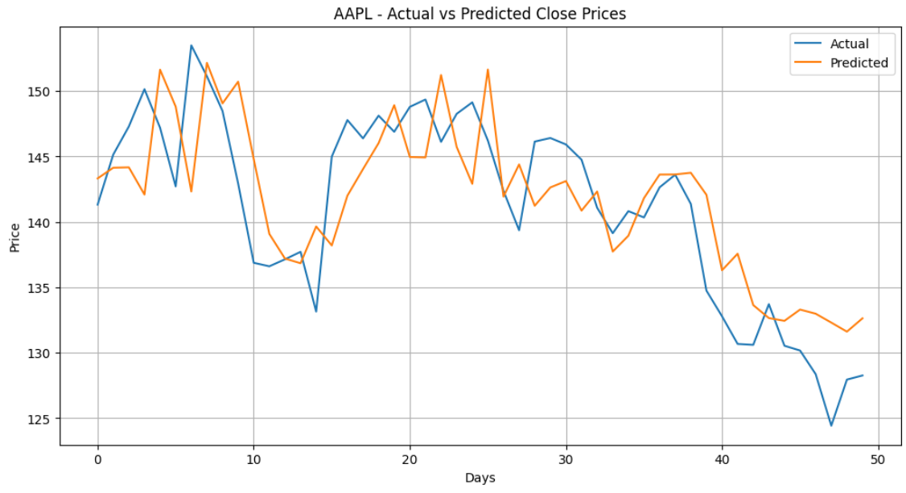

📈 Stock Price Prediction - ML Project

This project aims to predict the **next day's closing price** of a stock using historical data retrieved from Yahoo Finance via the `yfinance` library. It’s designed for learning and understanding the basics of time-series data handling, regression modeling, and financial prediction.

🧠 What You’ll Learn

- Working with stock market time-series data
- Fetching real-time financial data using APIs (`yfinance`)
- Creating predictive models using Linear Regression
- Visualizing real vs predicted prices


📊 Dataset Source

We use `yfinance` to download historical stock data (Open, High, Low, Close, Volume).

Example used: **Tesla (TSLA)** stock from Jan 2020 to present.

⚙️ Technologies Used

- Python
- Pandas, NumPy
- Scikit-learn
- Matplotlib, Seaborn
- yfinance

📌 How It Works

1. Data Loading: We fetch stock data using `yfinance`.
2. Feature Engineering: Use Open, High, Low, and Volume to predict the next day’s Close price.
3. Label Creation: A new column `Next_Close` is created by shifting the Close column up by one (`data['Close'].shift(-1)`).
4. Model Training: We split the data and train a **Linear Regression** model.
5. Prediction: Predict the next closing price using the model.
6. Visualization: Plot predicted vs actual Close prices for comparison.

🧪 Results & Output

Here’s a visualization comparing predicted vs actual closing prices:



You can also see the Mean Squared Error (MSE) value which tells us how close the predictions are to the actual values.

🔁 Future Improvements

- Use more advanced models like Random Forest, XGBoost, or LSTM (for deeper time-series analysis).
- Include technical indicators like RSI, Moving Averages, etc.
- Tune hyperparameters and try different feature combinations.

🚀 How to Run

1. Clone this repo:
   ```bash
   git clone https://github.com/your-username/Stock-Price-Prediction.git
   cd Stock-Price-Prediction
